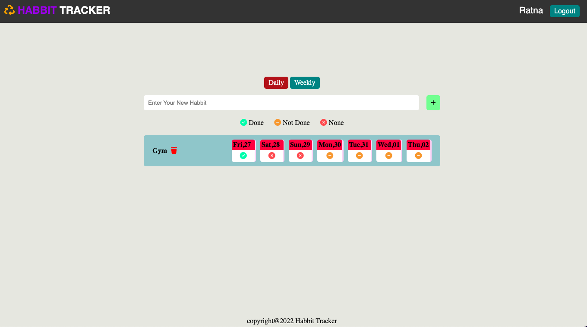

# Habbit Tracker App

### ScreenShots

#### Tech Used

1. Nodejs
2. Expressjs
3. Ejs
4. MongoDB

### local installation

1. clone the repository git clone https://github.com/rks1995/habbit-tracker.git
2. open the project folder and run npm install
3. Run npm start and go to localhost:5000

#### Folder Structure

|-assets  
|-controllers  
|-db  
|-error  
|-middleware  
|-models  
|-routes  
|-views  
|-gitignore  
|-app.js  
|-package-lock-json  
|-package.json  
|-README.MD
